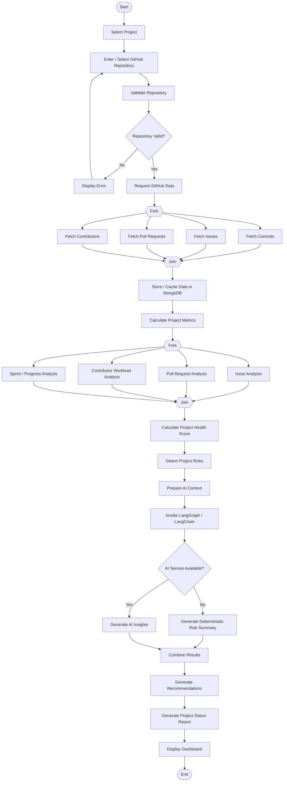

# AI Software Project Health & Risk Analyzer

> **An AI-assisted software project management platform that analyzes GitHub activity to evaluate project health, identify development risks, and generate actionable project insights.**


---

## Table of Contents

- [1. Project Overview](#1-project-overview)
- [2. Problem Statement](#2-problem-statement)
- [3. Proposed Solution](#3-proposed-solution)
- [4. Project Objectives](#4-project-objectives)
- [5. Project Scope](#5-project-scope)
- [6. Constraints](#6-constraints)
- [7. Target Users and Stakeholders](#7-target-users-and-stakeholders)
- [8. Technology Stack](#8-technology-stack)
- [9. High-Level Architecture](#9-high-level-architecture)
- [10. Core System Workflow](#10-core-system-workflow)
- [11. Data Strategy](#11-data-strategy)
- [12. MongoDB Design](#12-mongodb-design)
- [13. Analytics and Risk Engine](#13-analytics-and-risk-engine)
- [14. LangChain and LangGraph Strategy](#14-langchain-and-langgraph-strategy)
- [15. Embeddings and RAG](#15-embeddings-and-rag)
- [16. Functional Requirements](#16-functional-requirements)
- [17. Domain Requirements](#17-domain-requirements)
- [18. Non-Functional Requirements](#18-non-functional-requirements)
- [19. EPIC Structure](#19-epic-structure)
- [20. Complete User Stories](#20-complete-user-stories)
- [21. Sprint Plan](#21-sprint-plan)
- [22. Sprint Planning Process](#22-sprint-planning-process)
- [23. User Story Allocation](#23-user-story-allocation)
- [24. Domain Requirement Traceability](#24-domain-requirement-traceability)
- [25. Non-Functional Requirement Traceability](#25-non-functional-requirement-traceability)
- [26. Activity Diagram](#26-activity-diagram)
- [27. GitHub Workflow](#27-github-workflow)
- [28. Slack / Team Collaboration](#28-slack--team-collaboration)
- [29. Testing Strategy](#29-testing-strategy)
- [30. Deployment Strategy](#30-deployment-strategy)
- [31. MVP Boundary](#31-mvp-boundary)
- [32. Project Milestones](#32-project-milestones)
- [33. Final Submission Checklist](#33-final-submission-checklist)
- [34. Final Product Flow](#34-final-product-flow)

---

# 1. Project Overview

## Project Name

**AI Software Project Health & Risk Analyzer**

## Project Type

Software Engineering + AI-assisted Project Management Platform

## Development Methodology

**Agile / SCRUM** throughout the project lifecycle.

## Core Idea

The platform connects to a GitHub repository, collects project activity, converts that activity into structured metrics, identifies project risks, and uses GenAI to explain important findings and generate actionable recommendations.

The system is designed as a **Software Engineering product with an AI capability**, not simply as a chatbot or LLM wrapper.

---

# 2. Problem Statement

Software development information is often distributed across repositories, commits, issues, Pull Requests, contributors, milestones, and sprint activity. A project manager or team lead may need to inspect several sources manually to determine whether a project is healthy or at risk.

The project addresses this by creating one platform that can answer questions such as:

- How active is the project?
- Which issues are becoming stale?
- Are Pull Requests waiting too long for review or merge?
- Is development activity concentrated among a small number of contributors?
- Is project progress behind expected progress?
- What risks are currently visible?
- What actions could the team consider?

---

# 3. Proposed Solution

The system follows this pipeline:

```text
GitHub Repository
       ↓
GitHub API
       ↓
Data Collection
       ↓
MongoDB Storage / Cache
       ↓
Analytics Engine
       ↓
Risk & Health Engine
       ↓
LangGraph Workflow
       ↓
LangChain + LLM
       ↓
AI Explanations & Recommendations
       ↓
Project Dashboard + Status Report
```

## Main Outputs

- Project Health Score
- Risk Level
- Commit Activity
- Issue Statistics
- Stale Issues
- Pull Request Bottlenecks
- Contributor Activity / Workload Indicators
- Sprint / Progress Indicators
- AI Risk Explanations
- AI Recommendations
- AI-generated Project Status Report

---

# 4. Project Objectives

- [ ] Connect software projects with GitHub repositories.
- [ ] Collect relevant GitHub project activity through APIs.
- [ ] Store and cache project data efficiently.
- [ ] Calculate meaningful project-health metrics.
- [ ] Detect project risks using transparent and configurable rules.
- [ ] Generate human-readable explanations for important risks.
- [ ] Use LangChain and LangGraph to orchestrate GenAI analysis.
- [ ] Generate actionable recommendations.
- [ ] Present project information through a clear dashboard.
- [ ] Generate a project status report.
- [ ] Remain feasible under free-tier and no-GPU constraints.

---

# 5. Project Scope

## In Scope

### Repository and Project Management

- Create/select projects.
- Connect GitHub repositories.
- Validate repository access.
- Configure project-level thresholds.

### GitHub Data

- Repository metadata.
- Commits.
- Issues.
- Pull Requests.
- Contributors.
- Project/sprint-related activity where available.

### Analytics

- Commit activity.
- Issue activity.
- Pull Request activity.
- Stale issue detection.
- Contributor activity distribution.
- Workload imbalance indicators.
- Progress indicators.
- Schedule-risk indicators.

### AI

- Project summary.
- Risk explanations.
- Recommendations.
- Project status report.
- Optional RAG/project knowledge assistant.

### Dashboard

- Health overview.
- Analytics charts.
- Risk view.
- AI insight view.
- Report view.

## Out of Scope for the Initial MVP

- Training a large language model from scratch.
- GPU-based model training.
- Building a full Jira/GitHub replacement.
- Real-time processing of every repository event as a mandatory feature.
- Large-scale source-code analysis with an LLM as the primary data path.
- Complex microservices architecture unless later required.

---

# 6. Constraints

| Constraint | Project Decision |
|---|---|
| Frontend hosting | Free Vercel tier |
| Backend | Free-tier backend deployment |
| API usage | Free / limited API calls only; do not assume unlimited usage |
| GPU | No GPU dependency |
| Database | MongoDB / free-tier deployment |
| LLM | Free or limited API provider |
| AI efficiency | Analyze compact project metrics instead of sending all raw GitHub data |
| API efficiency | Cache, batch, paginate, and refresh only when necessary |

## Important Design Principle

The LLM should not be responsible for calculating every project metric.

```text
Python / Analytics Engine → facts and metrics
Risk Engine              → deterministic risk rules
LangGraph                → workflow orchestration
LangChain + LLM          → explanation and recommendation
Embeddings / RAG         → optional semantic retrieval
```

---

# 7. Target Users and Stakeholders

| Stakeholder | Role / Interest |
|---|---|
| Project Manager | Monitors project health, risks, and reports |
| Team Lead | Monitors workload, bottlenecks, and progress |
| Developer | Works within the project and may review warnings/feedback |
| Product Owner | Tracks progress and delivery-related risk |
| Repository Administrator | Manages GitHub integration and access |
| Client / Instructor | Interested in project status and outcome |
| Development Team | Builds, tests, reviews, and maintains the system |

---

# 8. Technology Stack

## Frontend

- **Next.js / React**
- **Tailwind CSS**
- **Recharts** or equivalent charting library
- **Vercel** for frontend deployment

## Backend

- **Python**
- **FastAPI**
- Pydantic / validation layer

## Database

- **MongoDB**

MongoDB is a suitable fit because GitHub API data is naturally document-oriented and often contains nested structures such as labels, users, review information, and timestamps.

## GitHub Integration

- GitHub REST API and/or GraphQL API as appropriate.

## AI

- **LangChain** for LLM, prompts, structured output, tools, retrievers, and related components.
- **LangGraph** for stateful AI workflow orchestration.
- Free/limited LLM API.

## Optional Advanced AI

- Embeddings
- Vector search
- RAG

## Deployment

```text
Frontend  → Vercel
Backend   → Free-tier backend platform
Database  → Free-tier MongoDB
AI        → Free/limited LLM API
```

---

# 9. High-Level Architecture

```text
                         ┌──────────────┐
                         │     USER     │
                         └──────┬───────┘
                                ↓
                     ┌────────────────────┐
                     │ Next.js / React    │
                     │ Vercel             │
                     └─────────┬──────────┘
                               ↓
                     ┌────────────────────┐
                     │ FastAPI Backend    │
                     └─────────┬──────────┘
                               │
             ┌─────────────────┼──────────────────┐
             ↓                 ↓                  ↓
      ┌─────────────┐  ┌─────────────┐   ┌─────────────┐
      │  GitHub API │  │   MongoDB   │   │   LLM API   │
      └──────┬──────┘  └──────┬──────┘   └──────┬──────┘
             │                │                  │
             └────────────────┼──────────────────┘
                              ↓
                     ┌────────────────────┐
                     │ Analytics Engine   │
                     └─────────┬──────────┘
                               ↓
                     ┌────────────────────┐
                     │ Risk & Health      │
                     │ Engine             │
                     └─────────┬──────────┘
                               ↓
                     ┌────────────────────┐
                     │ LangGraph Workflow │
                     └─────────┬──────────┘
                               ↓
                     ┌────────────────────┐
                     │ LangChain + LLM    │
                     └─────────┬──────────┘
                               ↓
                     ┌────────────────────┐
                     │ AI Insights /      │
                     │ Recommendations    │
                     └─────────┬──────────┘
                               ↓
                     ┌────────────────────┐
                     │ Dashboard / Report │
                     └────────────────────┘
```

---

# 10. Core System Workflow

```text
1. User creates or selects a project
2. User connects a GitHub repository
3. System validates the repository
4. System requests required GitHub data
5. GitHub data is stored/cached in MongoDB
6. Analytics Engine calculates project metrics
7. Risk Engine detects project risks
8. System prepares a compact AI context
9. LangGraph orchestrates AI analysis
10. LangChain communicates with the LLM
11. AI produces explanations and recommendations
12. System generates the project status report
13. Dashboard displays the final results
```

---

# 11. Data Strategy

## Do We Need a Traditional Dataset?

**No traditional ML training dataset is required for the MVP.**

The operational dataset comes from the connected GitHub repositories:

```text
GitHub Repository
       ↓
GitHub API
       ↓
MongoDB
       ↓
Analytics
       ↓
Risk Detection
       ↓
AI Analysis
```

The project becomes a **data-analysis application**, not a model-training project.

## When a Separate Dataset Would Be Needed

A traditional historical dataset becomes useful only if the team later decides to train a predictive model, for example:

> Predict whether a future sprint will be delayed.

That would require historical sprint/project examples containing features and target outcomes.

Such predictive ML is an optional extension, not an MVP requirement.

---

# 12. MongoDB Design

## Suggested Collections

```text
projects
repositories
commits
issues
pull_requests
contributors
sprints
metrics
risk_reports
ai_reports
feedback
audit_logs
```

## Example Issue Document

```json
{
  "issue_id": 101,
  "repository_id": "repo_001",
  "title": "Authentication fails after token refresh",
  "state": "open",
  "labels": ["bug", "authentication"],
  "assignee": "developer-a",
  "created_at": "...",
  "updated_at": "...",
  "closed_at": null
}
```

## Example Project Metrics Document

```json
{
  "project_id": "project_001",
  "commit_count": 184,
  "contributors": 8,
  "open_issues": 24,
  "stale_issues": 7,
  "open_prs": 12,
  "average_pr_review_days": 3.8,
  "sprint_completion": 62,
  "top_contributor_share": 0.44,
  "generated_at": "..."
}
```

## Database Principles

- Avoid one giant repository document.
- Keep project/repository relationships explicit.
- Store timestamps for synchronization and analysis.
- Avoid duplicate GitHub records.
- Store generated AI results separately from raw source data.
- Preserve enough metadata to trace an insight back to its underlying metrics.

---

# 13. Analytics and Risk Engine

## Metrics Engine

The first intelligence layer should be deterministic.

### Commit Metrics

- Total commits
- Commits over time
- Contributor activity
- Commit-frequency trends

### Issue Metrics

- Open issue count
- Closed issue count
- Issue age
- Resolution-time indicators
- Stale issue count

### Pull Request Metrics

- Open PR count
- Merged PR count
- PR age
- Review delay where data is available
- Merge turnaround where data is available

### Contributor Metrics

- Activity distribution
- Contribution concentration
- Project-specific workload indicators

### Progress Metrics

- Completed work
- Open work
- Sprint/project progress
- Expected vs actual progress where project data supports it

## Risk Categories

```text
STALE_ISSUE_RISK
PR_REVIEW_BOTTLENECK
WORKLOAD_IMBALANCE
SCHEDULE_RISK
```

## Example Rule Structure

```text
IF stale_issue_ratio exceeds project threshold
    → stale issue risk

IF review delay exceeds project threshold
    → PR bottleneck risk

IF contributor activity concentration exceeds configured threshold
    → workload imbalance indicator

IF actual progress falls below expected progress
    → schedule-risk indicator
```

## Important Domain Principle

The thresholds are **project-specific and configurable**. They should not be presented as universal truths.

---

# 14. LangChain and LangGraph Strategy

## Why LangChain?

LangChain is used for the AI components:

- LLM interface
- Prompt templates
- Structured output
- Tools
- Retrievers
- Embeddings if later required

## Why LangGraph?

LangGraph is used to orchestrate the analysis workflow as a structured graph.

## Recommended Graph

```text
START
  ↓
Load Project Metrics
  ↓
Load Risk Findings
  ↓
Prepare Compact AI Context
  ↓
Generate Analysis
  ↓
Generate Recommendations
  ↓
Generate Project Report
  ↓
Store / Cache Result
  ↓
END
```

## AI Input Principle

Do **not** send thousands of raw GitHub records to the LLM.

Instead:

```text
Raw GitHub Data
      ↓
Analytics Engine
      ↓
Compact Project Snapshot
      ↓
Risk Findings
      ↓
LangGraph
      ↓
LLM
```

### Example AI Context

```json
{
  "project_health": 74,
  "risk_level": "medium",
  "contributors": 8,
  "issue_metrics": {
    "open": 24,
    "stale": 7,
    "avg_resolution_days": 6.2
  },
  "pr_metrics": {
    "open": 12,
    "avg_review_days": 3.8,
    "avg_merge_days": 4.6
  },
  "workload": {
    "top_contributor_share": 0.44
  },
  "sprint": {
    "completion": 62,
    "expected_completion": 82
  },
  "risks": [
    "HIGH_PR_REVIEW_DELAY",
    "STALE_ISSUES",
    "WORKLOAD_IMBALANCE"
  ]
}
```

---

# 15. Embeddings and RAG

## Are Embeddings Required?

**No — embeddings are not required for the core MVP.**

Structured project metrics do not need embeddings.

Examples that do not require embeddings:

```text
Commit counts
Issue counts
Issue age
PR merge time
Contributor distribution
Sprint completion
Health calculations
Rule-based risk detection
```

## When Embeddings Become Useful

Embeddings are useful when the system needs semantic understanding of text.

Potential advanced features:

- Similar issue detection
- Duplicate issue detection
- Related PR retrieval
- Semantic project search
- Project knowledge assistant
- RAG-based explanations

## Optional RAG Architecture

```text
Issues / PR descriptions / documentation
                ↓
          Embedding Model
                ↓
          Vector Search
                ↓
       Relevant Project Context
                ↓
            LangGraph
                ↓
               LLM
                ↓
          Project Answer
```

## Recommended Decision

Build the MVP **without embeddings**.

Add embeddings only after the deterministic analytics + core GenAI pipeline works.

---

# 16. Functional Requirements

| ID | Requirement |
|---|---|
| FR-01 | The system shall allow a user to connect a GitHub repository. |
| FR-02 | The system shall validate repository information. |
| FR-03 | The system shall retrieve repository activity through GitHub APIs. |
| FR-04 | The system shall retrieve issue information. |
| FR-05 | The system shall retrieve Pull Request information. |
| FR-06 | The system shall retrieve contributor activity. |
| FR-07 | The system shall calculate project-health metrics. |
| FR-08 | The system shall identify stale issues. |
| FR-09 | The system shall identify Pull Request bottlenecks. |
| FR-10 | The system shall estimate contributor workload imbalance. |
| FR-11 | The system shall identify project risks. |
| FR-12 | The system shall generate AI-based project insights. |
| FR-13 | The system shall generate actionable recommendations. |
| FR-14 | The system shall generate a project status report. |
| FR-15 | The system shall display project metrics in a dashboard. |

---

# 17. Domain Requirements

| ID | Domain Concept | Domain Requirement |
|---|---|---|
| DR-01 | Repository | GitHub repository metadata (branches, default branch, visibility) defines the scope of analyzable data; the system shall operate against the repository's default branch unless configured otherwise. |
| DR-02 | Commit | Commit activity reflects only work that has been pushed to GitHub; local or uncommitted work is invisible to the system and shall not be treated as an absence of work. |
| DR-03 | Contributor / Workload | GitHub provides no standardized workload or capacity metric; "overload" is a domain-specific, configurable threshold rather than a fixed API value, and the system shall treat it as such. |
| DR-04 | Issue | Issue "staleness" has no universal definition across teams; the system shall allow the inactivity threshold that defines a stale issue to be configured per project. |
| DR-05 | Pull Request / Code Review | Acceptable review-turnaround time varies by team norm and by PR size/complexity; the system shall treat "delay" as a configurable threshold rather than a fixed duration. |
| DR-06 | Sprint | Sprint structures and blocker definitions differ across tools (GitHub Projects, Jira, etc.); the domain model shall accommodate this variation rather than assume one fixed sprint structure. |
| DR-07 | Milestone / Task | GitHub milestones do not enforce task-level granularity; the system shall infer progress from whatever milestone/issue structure a project actually uses, which may be incomplete or inconsistent. |
| DR-08 | Schedule & Project Risk | Schedule-risk indicators (e.g., velocity, burn-down trends) are estimates derived from historical activity, not guaranteed predictors; the system shall present them as indicative, not deterministic. |
| DR-09 | Project Health | "Project health" is a composite, subjective judgment rather than a directly measurable quantity; the system shall base it on a transparent, explainable combination of selected metrics rather than a single opaque score. |
| DR-10 | Integration | GitHub and Slack impose their own API rate limits, authentication models (OAuth/tokens), and webhook event formats; the system's integration layer shall conform to these external constraints rather than assume custom control over them. |

---

# 18. Non-Functional Requirements

| ID | Category | Requirement |
|---|---|---|
| NFR-01 | Usability | The system shall present key information (risk status, alerts, recommendations) on the dashboard in a way that is understandable without training or a user manual. |
| NFR-02 | Performance / Latency | Dashboard views and API responses shall load within 3 seconds under normal network conditions. AI risk recalculation shall complete within 60 seconds of a triggering GitHub or Slack webhook event. |
| NFR-03 | Error Handling | The system shall detect invalid API responses and external-service outages (GitHub, Slack) and display a clear degraded-mode message rather than failing silently or crashing. |
| NFR-04 | API Efficiency | The system shall batch and minimize external API calls so as to remain within the external service's rate limits. |
| NFR-05 | Caching | The system shall cache repository, commit, and Pull Request data for a defined interval (e.g., 15 minutes) and invalidate the cache when a relevant webhook event is received. |
| NFR-06 | Security | The system shall store GitHub credentials, API keys, and project-related information encrypted at rest (e.g., via environment variables or a secrets manager) and shall never expose them in logs or client-side code. |
| NFR-07 | Explainability | The system shall provide a human-readable explanation, naming the contributing metrics, for every AI-generated risk flag or recommendation. |
| NFR-08 | Feedback / Appeal | The system shall allow a developer affected by an AI-generated warning to submit feedback disputing it, and shall record that feedback for review. |
| NFR-09 | Fairness | The system's risk-scoring logic shall be reviewed to avoid systematically penalizing contributors with legitimately different but non-problematic work patterns (e.g., part-time contributors, or reviewers with slower but thorough turnaround). |
| NFR-10 | Auditability | The system shall log key actions (external API calls, generated warnings, configuration changes) in a retrievable format for administrator review. |
| NFR-11 | Resource Constraint | The system shall operate within the limits of the selected free-tier deployment plan (e.g., request quotas, compute and storage caps). |

---

# 19. EPIC Structure

| Epic ID | Epic | Purpose |
|---|---|---|
| E-01 | User & Project Management | Manage projects and repository connections |
| E-02 | GitHub Integration & Data Collection | Collect and synchronize repository data |
| E-03 | Project Analytics | Convert repository activity into metrics |
| E-04 | Risk & Health Analysis | Identify risks and calculate project health |
| E-05 | GenAI Project Intelligence | Explain findings and generate recommendations/reports |
| E-06 | Dashboard & Reporting | Present analytics, risks, insights, and reports |
| E-07 | Testing, Deployment & Quality | Validate, secure, deploy, and finalize the product |

---

# 20. Complete User Stories

## E-01 — User & Project Management

### US-01 — User Access

**As a** Project Manager  
**I want** to access the project health system  
**So that** I can monitor my software project.

**Acceptance Criteria**
- [ ] User can access the application.
- [ ] User sees the application entry point.
- [ ] Invalid access is handled appropriately if authentication is implemented.
- [ ] Invalid input produces a clear error.

### US-02 — Create Project

**As a** Project Manager  
**I want** to create a project  
**So that** I can associate repository and analysis data with it.

**Acceptance Criteria**
- [ ] User can enter project name.
- [ ] User can optionally provide project description.
- [ ] Project is stored successfully.
- [ ] Created project appears in the project list.

### US-03 — Connect GitHub Repository

**As a** Project Manager  
**I want** to connect a GitHub repository  
**So that** the system can analyze my project.

**Acceptance Criteria**
- [ ] User can provide/select a repository.
- [ ] Repository is validated.
- [ ] Valid repository information is stored.
- [ ] Invalid or inaccessible repositories produce a clear error.

### US-04 — Select Project

**As a** Project Manager  
**I want** to select an existing project  
**So that** I can view its latest analysis.

**Acceptance Criteria**
- [ ] User can see available projects.
- [ ] User can select a project.
- [ ] Selected project opens its dashboard.
- [ ] Correct project data is displayed.

---

## E-02 — GitHub Integration & Data Collection

### US-05 — Retrieve Repository Metadata

**As a** system  
**I want** to retrieve repository information  
**So that** the application can identify the connected repository.

**Acceptance Criteria**
- [ ] Repository name is retrieved.
- [ ] Owner information is retrieved.
- [ ] Repository metadata is stored.
- [ ] API errors are handled.

### US-06 — Retrieve Commits

**As a** system  
**I want** to retrieve commit activity  
**So that** development activity can be analyzed.

**Acceptance Criteria**
- [ ] Commits are retrieved through the GitHub API.
- [ ] Commit author and timestamp are stored.
- [ ] Pagination is supported where required.
- [ ] Duplicate records are avoided.

### US-07 — Retrieve Issues

**As a** system  
**I want** to retrieve repository issues  
**So that** issue activity can be analyzed.

**Acceptance Criteria**
- [ ] Open issues are retrieved.
- [ ] Closed issues are retrieved where required.
- [ ] Creation/update/closure information is stored.
- [ ] Labels and assignees are stored where applicable.

### US-08 — Retrieve Pull Requests

**As a** system  
**I want** to retrieve Pull Request information  
**So that** review and merge activity can be analyzed.

**Acceptance Criteria**
- [ ] Open PRs are retrieved.
- [ ] Closed/merged PRs are retrieved where required.
- [ ] PR author and timestamps are stored.
- [ ] Review-related data is stored where available.

### US-09 — Retrieve Contributors

**As a** Team Lead  
**I want** contributor activity  
**So that** workload and contribution patterns can be analyzed.

**Acceptance Criteria**
- [ ] Contributors are identified.
- [ ] Contributor activity is calculated/stored.
- [ ] Contributor information is linked to the project.

### US-10 — Synchronize GitHub Data

**As a** Project Manager  
**I want** to refresh project data  
**So that** my dashboard reflects recent repository activity.

**Acceptance Criteria**
- [ ] User can request a refresh.
- [ ] System fetches new/changed information.
- [ ] Existing information is not unnecessarily duplicated.
- [ ] Last synchronization time is displayed.

### US-11 — Handle API Limits

**As a** system administrator  
**I want** the system to handle GitHub API limits  
**So that** the application remains usable under limited API usage.

**Acceptance Criteria**
- [ ] API rate-limit information is handled.
- [ ] Failed requests do not crash the application.
- [ ] Cached information can be displayed.
- [ ] User receives a meaningful message when new data cannot be retrieved.

---

## E-03 — Project Analytics

### US-12 — Commit Activity Analysis

**As a** Team Lead  
**I want** to view commit activity  
**So that** I can understand development activity over time.

### US-13 — Issue Analysis

**As a** Project Manager  
**I want** issue statistics  
**So that** I can understand project workload and issue management.

### US-14 — Stale Issue Detection

**As a** Team Lead  
**I want** to identify stale issues  
**So that** inactive work can be reviewed.

**Acceptance Criteria**
- [ ] Inactivity period is calculated.
- [ ] Configurable threshold is applied.
- [ ] Issues exceeding the threshold are marked as stale.
- [ ] Stale issues appear in the dashboard.

### US-15 — Pull Request Analysis

**As a** Team Lead  
**I want** PR statistics  
**So that** I can identify review and merge bottlenecks.

### US-16 — Contributor Workload Analysis

**As a** Team Lead  
**I want** to analyze contributor activity  
**So that** I can identify workload imbalance indicators.

### US-17 — Sprint / Progress Analysis

**As a** Project Manager  
**I want** to view project progress  
**So that** I can determine whether the project is on schedule.

---

## E-04 — Risk & Health Analysis

### US-18 — Project Health Score

**As a** Project Manager  
**I want** an overall project health score  
**So that** I can understand project condition quickly.

**Acceptance Criteria**
- [ ] Health metrics are calculated.
- [ ] Metrics contribute through a documented formula.
- [ ] Score is displayed clearly.
- [ ] Score is explainable.

### US-19 — Risk Level

**As a** Project Manager  
**I want** an overall project risk level  
**So that** I can identify areas requiring attention.

### US-20 — PR Bottleneck Detection

**As a** Team Lead  
**I want** the system to detect PR bottlenecks  
**So that** code-review delays can be investigated.

### US-21 — Workload Imbalance Detection

**As a** Team Lead  
**I want** the system to identify workload imbalance indicators  
**So that** the team can investigate whether work distribution requires attention.

### US-22 — Schedule Risk Detection

**As a** Project Manager  
**I want** schedule-risk indicators  
**So that** I can identify deviations from expected project progress.

### US-23 — Risk Explanation

**As a** Project Manager  
**I want** to understand why a risk was detected  
**So that** I can investigate the underlying project conditions.

**Acceptance Criteria**
- [ ] Each major risk has an explanation.
- [ ] Supporting project metrics are shown.
- [ ] Explanation is understandable.

---

## E-05 — GenAI Project Intelligence

### US-24 — Generate AI Project Summary

**As a** Project Manager  
**I want** an AI-generated project summary  
**So that** I can understand project status quickly.

### US-25 — Generate Recommendations

**As a** Team Lead  
**I want** actionable recommendations  
**So that** I can investigate possible actions based on detected risks.

### US-26 — AI Risk Explanation

**As a** Project Manager  
**I want** AI to explain detected project risks  
**So that** I can understand the underlying project signals.

### US-27 — Generate Project Status Report

**As a** Project Manager  
**I want** an AI-generated project status report  
**So that** I can communicate project status to stakeholders.

### US-28 — Project Knowledge Assistant [Advanced]

**As a** Team Lead  
**I want** to ask questions about project issues and PRs  
**So that** I can investigate project history efficiently.

> This is the primary story for optional embeddings/RAG functionality.

---

## E-06 — Dashboard & Reporting

### US-29 — Project Health Dashboard

**As a** Project Manager  
**I want** a project health dashboard  
**So that** I can understand the project at a glance.

### US-30 — Analytics Charts

**As a** Team Lead  
**I want** project activity charts  
**So that** I can identify trends visually.

### US-31 — Risk Dashboard

**As a** Project Manager  
**I want** a dedicated risk view  
**So that** I can inspect project risks.

### US-32 — Report View

**As a** Project Manager  
**I want** to view the generated project report  
**So that** I can inspect project status information.

---

## E-07 — Testing, Deployment & Quality

### US-33 — API Error Handling

**As a** user  
**I want** clear error messages  
**So that** I understand what went wrong.

### US-34 — Unit Testing

**As a** developer  
**I want** core analytical components to have tests  
**So that** changes do not silently break calculations.

### US-35 — Integration Testing

**As a** developer  
**I want** external integrations to be tested  
**So that** GitHub/database/AI workflows function correctly.

### US-36 — Production Deployment

**As a** user  
**I want** the application to be accessible online  
**So that** I can use it without running it locally.

---

# 21. Sprint Plan

## Sprint Overview

| Sprint | Main Goal | Primary EPICs | Main Outcome |
|---|---|---|---|
| Sprint 1 | Foundation & Initial Product Skeleton | E-01 + E-06 foundation | Requirements, setup, project workflow, concept poster, initial UI/backend |
| Sprint 2 | GitHub Integration & Data Pipeline | E-02 | Reliable GitHub data collection, MongoDB storage, synchronization, caching |
| Sprint 3 | Analytics, Health & Risk | E-03 + E-04 + E-06 | Metrics, health score, risk engine, analytics dashboard |
| Sprint 4 | GenAI & Reporting | E-05 + E-06 | LangChain/LangGraph AI analysis, recommendations, reports |
| Sprint 5 | Testing, Security & Deployment | E-07 + final E-06 | Tested, secured, deployed final product |

---

## Sprint 1 — Foundation, Requirements & Initial Product Skeleton

### Goal

Create the project foundation, baseline requirements and backlog, establish the technical architecture and collaboration workflow, and produce the first working application skeleton.

### User Stories

| ID | Priority | Points |
|---|---:|---:|
| US-01 | Medium | 3 |
| US-02 | High | 3 |
| US-03 | High | 5 |
| US-04 | Medium | 3 |

**Candidate points:** 14

### Tasks

- [ ] Finalize stakeholder analysis.
- [ ] Finalize requirement-elicitation plan.
- [ ] Record elicitation findings.
- [ ] Baseline functional requirements.
- [ ] Baseline non-functional requirements.
- [ ] Baseline domain requirements.
- [ ] Create Product Backlog.
- [ ] Define EPICs.
- [ ] Define Sprint 1 Backlog.
- [ ] Identify initial requirement conflicts.
- [ ] Define Definition of Done.
- [ ] Create GitHub repository.
- [ ] Add all team members as contributors.
- [ ] Establish GitHub branching/PR workflow.
- [ ] Establish Slack channels.
- [ ] Create frontend application.
- [ ] Create backend FastAPI application.
- [ ] Create MongoDB database.
- [ ] Create initial dashboard shell.
- [ ] Create project/repository input flow.
- [ ] Create architecture diagram.
- [ ] Prepare concept poster.

### Definition of Done

- [ ] Project can be created.
- [ ] Existing project can be selected.
- [ ] GitHub repository input/validation flow exists.
- [ ] Frontend communicates with backend.
- [ ] MongoDB is connected.
- [ ] Concept poster is completed.
- [ ] Acceptance criteria are satisfied.
- [ ] Actual contributors have committed their work.

### Sprint Review

Demonstrate:

```text
Create Project
     ↓
Select Project
     ↓
Enter GitHub Repository
     ↓
Validate Repository
     ↓
Open Project
```

---

## Sprint 2 — GitHub Integration & Data Pipeline

### Goal

Connect GitHub and reliably collect, store, synchronize, cache, and handle core project data.

### User Stories

| ID | Priority | Points |
|---|---:|---:|
| US-05 | High | 3 |
| US-06 | High | 5 |
| US-07 | High | 5 |
| US-08 | High | 5 |
| US-09 | High | 3 |
| US-10 | High | 5 |
| US-11 | High | 5 |

**Candidate points:** 31

### Tasks

- [ ] Implement GitHub API client.
- [ ] Validate repository access.
- [ ] Retrieve repository metadata.
- [ ] Retrieve commits.
- [ ] Retrieve issues.
- [ ] Retrieve Pull Requests.
- [ ] Retrieve contributors.
- [ ] Implement pagination.
- [ ] Store data in MongoDB.
- [ ] Avoid duplicate records.
- [ ] Implement synchronization.
- [ ] Record last synchronization time.
- [ ] Implement caching.
- [ ] Implement API-limit handling.
- [ ] Handle external-service failures.
- [ ] Provide degraded-mode messages.

### Definition of Done

- [ ] Valid repository can be connected.
- [ ] Repository metadata stored.
- [ ] Commits stored.
- [ ] Issues stored.
- [ ] PRs stored.
- [ ] Contributors stored.
- [ ] Data can be refreshed.
- [ ] API failure is handled.
- [ ] Rate-limit behavior is handled.
- [ ] Cache behavior is implemented.

### Sprint Review

```text
Repository
    ↓
GitHub API
    ↓
Metadata / Commits / Issues / PRs / Contributors
    ↓
MongoDB
    ↓
Refresh + Cache
```

---

## Sprint 3 — Project Analytics, Health & Risk Engine

### Goal

Turn stored GitHub activity into measurable project-health indicators and deterministic risk findings.

### User Stories

| ID | Priority | Points |
|---|---:|---:|
| US-12 | High | 3 |
| US-13 | High | 3 |
| US-14 | High | 5 |
| US-15 | High | 5 |
| US-16 | High | 5 |
| US-17 | High | 5 |
| US-18 | High | 5 |
| US-19 | High | 3 |
| US-20 | High | 5 |
| US-21 | High | 5 |
| US-22 | Medium | 5 |
| US-23 | High | 5 |
| US-29 | High | 5 |
| US-30 | High | 5 |

**Candidate points:** 64

> The number of points is a planning estimate. Before committing, compare the candidate scope with actual team capacity and observed velocity. Stories can be moved to keep the Sprint achievable.

### Tasks

- [ ] Define metric formulas.
- [ ] Implement commit metrics.
- [ ] Implement issue metrics.
- [ ] Implement stale-issue detection.
- [ ] Implement PR metrics.
- [ ] Implement contributor metrics.
- [ ] Implement progress metrics.
- [ ] Define transparent health-score formula.
- [ ] Implement configurable risk rules.
- [ ] Implement PR bottleneck detection.
- [ ] Implement workload imbalance indicators.
- [ ] Implement schedule-risk indicators.
- [ ] Implement risk explanations based on metrics.
- [ ] Build project health dashboard.
- [ ] Build analytics charts.
- [ ] Add risk dashboard foundations.
- [ ] Write unit tests for analytical calculations.

### Definition of Done

- [ ] Core metrics are calculated.
- [ ] Thresholds are documented/configurable.
- [ ] Health-score formula is documented.
- [ ] Risk rules are deterministic and testable.
- [ ] Supporting metrics are shown with risk findings.
- [ ] Dashboard displays analytics.
- [ ] Charts work.
- [ ] Core analytical tests pass.

### Sprint Review

```text
MongoDB
    ↓
Analytics Engine
    ↓
Health Score + Risk Engine
    ↓
Dashboard
```

---

## Sprint 4 — LangChain, LangGraph, GenAI & Reporting

### Goal

Add GenAI on top of validated metrics/risk findings and generate explanations, recommendations, and project reports.

### User Stories

| ID | Priority | Points |
|---|---:|---:|
| US-24 | High | 5 |
| US-25 | High | 5 |
| US-26 | High | 5 |
| US-27 | High | 8 |
| US-31 | High | 5 |
| US-32 | High | 5 |
| US-28 | Low / Advanced | 8 |

**Core candidate points excluding US-28:** 33  
**Optional advanced points:** 8

### Tasks

- [ ] Select a free/limited LLM API.
- [ ] Configure LangChain.
- [ ] Configure LangGraph.
- [ ] Define graph state.
- [ ] Define AI input schema.
- [ ] Prepare compact project context.
- [ ] Implement AI project summary.
- [ ] Implement AI risk explanation.
- [ ] Implement recommendations.
- [ ] Implement project status report.
- [ ] Implement AI result caching.
- [ ] Handle LLM API failures.
- [ ] Add report UI.
- [ ] Complete risk dashboard.
- [ ] Validate AI outputs against underlying metrics.
- [ ] Implement embeddings/RAG only if core MVP is stable.

### Definition of Done

- [ ] LangChain integrated.
- [ ] LangGraph workflow works.
- [ ] AI input/output format documented.
- [ ] AI summary works.
- [ ] Risk explanations work.
- [ ] Recommendations work.
- [ ] Project report works.
- [ ] AI failures do not break the dashboard.
- [ ] AI output is tied to project metrics.
- [ ] AI results are cached where appropriate.
- [ ] No GPU dependency exists.

### Sprint Review

```text
Project Metrics
      ↓
Risk Engine
      ↓
LangGraph
      ↓
LangChain + LLM
      ↓
AI Explanation
      ↓
Recommendations
      ↓
Project Report
```

---

## Sprint 5 — Testing, Security, Auditability, Deployment & Finalization

### Goal

Validate the complete system, address cross-cutting quality requirements, deploy the application, and prepare final documentation and demonstration.

### User Stories

| ID | Priority | Points |
|---|---:|---:|
| US-33 | High | 5 |
| US-34 | High | 5 |
| US-35 | High | 8 |
| US-36 | High | 5 |

**Candidate points:** 23

### Tasks

- [ ] Complete unit tests.
- [ ] Complete integration tests.
- [ ] Complete system/end-to-end tests.
- [ ] Verify every major acceptance criterion.
- [ ] Test invalid repositories.
- [ ] Test GitHub outages/rate limits.
- [ ] Test MongoDB failure behavior.
- [ ] Test LLM failure behavior.
- [ ] Test malformed AI responses.
- [ ] Validate secrets and environment variables.
- [ ] Verify sensitive information is not logged.
- [ ] Verify audit logging.
- [ ] Verify developer feedback/appeal workflow.
- [ ] Perform performance checks.
- [ ] Fix critical bugs.
- [ ] Deploy frontend to Vercel.
- [ ] Deploy backend to selected free-tier platform.
- [ ] Configure production MongoDB.
- [ ] Test production environment.
- [ ] Prepare final report.
- [ ] Prepare final presentation.
- [ ] Rehearse final demo.

### Definition of Done

- [ ] Critical functional requirements pass acceptance testing.
- [ ] Applicable NFRs are verified with evidence.
- [ ] Major defects are fixed.
- [ ] Application is deployed.
- [ ] End-to-end production workflow works.
- [ ] Documentation is complete.
- [ ] Final presentation/demo is ready.

---

# 22. Sprint Planning Process

Use the following process for every Sprint.

## Step 1 — Define Sprint Goal

Write one measurable outcome.

Example:

> Sprint 3 Goal: Convert repository activity into measurable project-health indicators and display them in a functional dashboard.

## Step 2 — Select User Stories

Choose stories based on:

- Priority
- Dependencies
- Team capacity
- Previous Sprint velocity

## Step 3 — Break Stories into Tasks

Example:

```text
US-14 Stale Issue Detection
        ↓
Fetch issue data
        ↓
Calculate last activity
        ↓
Apply configured threshold
        ↓
Mark stale issues
        ↓
Store result
        ↓
Display result
        ↓
Test
```

## Step 4 — Assign Owners

Every implementation task should have a clear owner.

## Step 5 — Estimate

Suggested story-point scale:

| Points | Meaning |
|---:|---|
| 1 | Very small |
| 2 | Small |
| 3 | Moderate |
| 5 | Complex |
| 8 | Very complex |
| 13 | Too large — split the story |

## Step 6 — Definition of Done

A story is Done only when:

- [ ] Acceptance criteria satisfied.
- [ ] Relevant tests passed.
- [ ] Code committed by actual contributor.
- [ ] Review completed where applicable.
- [ ] Documentation updated where necessary.

## Step 7 — Daily Stand-up

Each member reports:

```text
Yesterday:
What I completed.

Today:
What I will work on.

Blocker:
What is preventing progress.
```

## Step 8 — Sprint Review

Demonstrate the working increment.

## Step 9 — Retrospective

Document:

```text
What went well?
What did not go well?
What should change next Sprint?
```

---

# 23. User Story Allocation

| Story | EPIC | Sprint |
|---|---|---:|
| US-01 | E-01 | 1 |
| US-02 | E-01 | 1 |
| US-03 | E-01 | 1 |
| US-04 | E-01 | 1 |
| US-05 | E-02 | 2 |
| US-06 | E-02 | 2 |
| US-07 | E-02 | 2 |
| US-08 | E-02 | 2 |
| US-09 | E-02 | 2 |
| US-10 | E-02 | 2 |
| US-11 | E-02 | 2 |
| US-12 | E-03 | 3 |
| US-13 | E-03 | 3 |
| US-14 | E-03 | 3 |
| US-15 | E-03 | 3 |
| US-16 | E-03 | 3 |
| US-17 | E-03 | 3 |
| US-18 | E-04 | 3 |
| US-19 | E-04 | 3 |
| US-20 | E-04 | 3 |
| US-21 | E-04 | 3 |
| US-22 | E-04 | 3 |
| US-23 | E-04 | 3 |
| US-24 | E-05 | 4 |
| US-25 | E-05 | 4 |
| US-26 | E-05 | 4 |
| US-27 | E-05 | 4 |
| US-28 | E-05 | 4 (Optional) |
| US-29 | E-06 | 3 |
| US-30 | E-06 | 3 |
| US-31 | E-06 | 4 |
| US-32 | E-06 | 4 |
| US-33 | E-07 | 5 |
| US-34 | E-07 | 5 |
| US-35 | E-07 | 5 |
| US-36 | E-07 | 5 |

---

# 24. Domain Requirement Traceability

| Domain Requirement | Main Sprints | Related Stories |
|---|---|---|
| DR-01 Repository scope/default branch | S1–S2 | US-03, US-05, US-10 |
| DR-02 Pushed/visible commit activity | S2–S3 | US-06, US-12 |
| DR-03 Configurable workload/overload concept | S3 | US-16, US-21 |
| DR-04 Configurable stale-issue threshold | S3 | US-14 |
| DR-05 Configurable PR-delay threshold | S3 | US-15, US-20 |
| DR-06 Variable sprint structures | S1–S3 | US-02, US-04, US-17 |
| DR-07 Variable/incomplete milestone/task structures | S2–S3 | US-07, US-17 |
| DR-08 Indicative schedule-risk results | S3–S5 | US-22, US-23, US-26 |
| DR-09 Transparent composite project health | S3–S5 | US-18, US-19, US-23, US-26 |
| DR-10 External API/authentication/rate constraints | S1–S5 | US-03, US-10, US-11, US-33 |

---

# 25. Non-Functional Requirement Traceability

| NFR | Primary Sprint | Verification |
|---|---:|---|
| NFR-01 Usability | 1, 3, 4, 5 | Usability review + acceptance testing |
| NFR-02 Performance / Latency | 2, 3, 4, 5 | API/dashboard/AI timing tests |
| NFR-03 Error Handling | 2, 4, 5 | Failure + integration tests |
| NFR-04 API Efficiency | 2, 4, 5 | API/caching inspection |
| NFR-05 Caching | 2, 4, 5 | Synchronization/cache tests |
| NFR-06 Security | 1, 2, 5 | Configuration/security review |
| NFR-07 Explainability | 3, 4, 5 | Risk/output inspection |
| NFR-08 Feedback / Appeal | 4, 5 | User acceptance testing |
| NFR-09 Fairness | 3, 4, 5 | Scenario/rule review |
| NFR-10 Auditability | 2, 4, 5 | Log inspection |
| NFR-11 Resource Constraint | 1–5 | Quota/resource/deployment review |

---

# 26. Activity Diagram

## Selected Major Functionality

**GitHub Repository Analysis → Project Health & Risk Analysis → AI Project Report Generation**

This functionality is suitable because it includes:

- Multiple actors/services.
- Multiple actions.
- Decision points.
- Parallel processing.
- Alternate/failure paths.
- A complete end-to-end business workflow.

## Activity Flow Reference

> **Important:** The course requires the submitted activity diagram to be **hand-drawn** and submitted as a clear photograph or scan. The diagram below is a digital planning/reference version only.



## Hand-Drawn Swimlanes

Recommended lanes:

```text
┌────────────────────┬────────────────────┬────────────────────┬─────────────────┐
│ Project Manager    │ System             │ GitHub API         │ AI Service      │
├────────────────────┼────────────────────┼────────────────────┼─────────────────┤
│ Select Project     │                    │                    │                 │
│ Enter Repository   │ Validate           │                    │                 │
│                    │                    │ Fetch Commits      │                 │
│                    │                    │ Fetch Issues       │                 │
│                    │                    │ Fetch PRs          │                 │
│                    │ Store / Cache      │                    │                 │
│                    │ Calculate Metrics   │                    │                 │
│                    │ Detect Risks       │                    │                 │
│                    │ Invoke LangGraph   │                    │ Analyze Context │
│                    │                    │                    │ Generate Insight│
│                    │ Generate Report     │                    │                 │
│ View Dashboard     │                    │                    │                 │
└────────────────────┴────────────────────┴────────────────────┴─────────────────┘
```

---

# 27. GitHub Workflow

All development should follow a visible Git workflow.

```text
Product Backlog
      ↓
Sprint Backlog
      ↓
GitHub Issue
      ↓
Feature Branch
      ↓
Implementation
      ↓
Commit by Actual Contributor
      ↓
Pull Request
      ↓
Review
      ↓
Tests
      ↓
Merge
      ↓
Sprint Review
```

## Suggested Branches

```text
feature/us-03-github-repository
feature/us-07-issues
feature/us-14-stale-issues
feature/us-18-health-score
feature/us-24-ai-summary
feature/us-27-project-report
```

## Contribution Rules

- [ ] Every team member is added as a repository contributor.
- [ ] A person commits the work they actually performed.
- [ ] Tasks are represented by GitHub Issues.
- [ ] Feature work uses branches.
- [ ] Pull Requests are used for integration/review.
- [ ] Commit messages clearly describe the work.
- [ ] Sprint work can be traced from Issue → Branch → Commit → PR.

---

# 28. Slack / Team Collaboration

Team communication should remain visible through Slack.

## Suggested Channels

```text
#general
#requirements
#sprint-1
#sprint-2
#sprint-3
#sprint-4
#sprint-5
#frontend
#backend
#ai
#testing
#devops
```

## Useful Slack Evidence

Maintain visible records of:

- Sprint planning decisions.
- Technical decisions.
- Daily/regular updates.
- Blockers.
- Requirement discussions.
- Review decisions.
- Integration problems.
- Retrospective outcomes.

---

# 29. Testing Strategy

## Unit Testing

Test individual functions/modules:

- [ ] Repository validation.
- [ ] Data transformation.
- [ ] Commit metrics.
- [ ] Issue metrics.
- [ ] Stale issue detection.
- [ ] PR metrics.
- [ ] Workload calculations.
- [ ] Schedule-risk rules.
- [ ] Health-score calculation.

## Integration Testing

```text
Frontend ↔ Backend
Backend ↔ GitHub API
Backend ↔ MongoDB
Backend ↔ LangChain / LangGraph
Backend ↔ LLM API
```

## System Testing

End-to-end:

```text
Connect Repository
      ↓
Fetch Data
      ↓
Analyze
      ↓
Detect Risks
      ↓
Generate AI Insights
      ↓
Generate Report
      ↓
View Dashboard
```

## Important Edge Cases

- [ ] Invalid repository.
- [ ] Inaccessible repository.
- [ ] GitHub API failure.
- [ ] API rate-limit condition.
- [ ] Empty repository.
- [ ] No issues.
- [ ] No Pull Requests.
- [ ] Missing/partial data.
- [ ] MongoDB unavailable.
- [ ] LLM unavailable.
- [ ] Malformed AI output.
- [ ] Network failure.

---

# 30. Deployment Strategy

```text
Frontend
   ↓
Vercel

Backend
   ↓
Free-tier backend platform

Database
   ↓
Free-tier MongoDB

AI
   ↓
Free/limited LLM API
```

## Deployment Checklist

- [ ] Production frontend configured.
- [ ] Production backend configured.
- [ ] Database configured.
- [ ] Environment variables secured.
- [ ] GitHub integration tested in production.
- [ ] LLM integration tested in production.
- [ ] Free-tier limits reviewed.
- [ ] Production error handling verified.
- [ ] Final application URL documented.

---

# 31. MVP Boundary

## Must Have

- [ ] User/project access.
- [ ] Project creation/selection.
- [ ] GitHub repository connection.
- [ ] Repository metadata.
- [ ] Commits.
- [ ] Issues.
- [ ] Pull Requests.
- [ ] Contributors.
- [ ] Data synchronization.
- [ ] API-limit handling.
- [ ] Core analytics.
- [ ] Stale issue detection.
- [ ] PR bottleneck detection.
- [ ] Contributor workload indicators.
- [ ] Schedule-risk indicators.
- [ ] Transparent project health score.
- [ ] Risk dashboard.
- [ ] Project dashboard.
- [ ] LangChain integration.
- [ ] LangGraph workflow.
- [ ] AI summary.
- [ ] AI recommendations.
- [ ] AI risk explanation.
- [ ] Project report.
- [ ] Testing.
- [ ] Deployment.

## Advanced / Optional

- [ ] Embeddings.
- [ ] RAG.
- [ ] Semantic issue search.
- [ ] Similar/duplicate issue detection.
- [ ] Project knowledge assistant.
- [ ] Predictive ML.
- [ ] More advanced event-driven processing.

---

# 32. Project Milestones

| Milestone | Expected Output |
|---|---|
| M1 | Requirements + stakeholders + elicitation + backlog |
| M2 | Architecture + Sprint 1 + concept poster |
| M3 | Working GitHub integration + MongoDB pipeline |
| M4 | Analytics + health/risk engine + dashboard |
| M5 | LangChain/LangGraph + AI insights + report |
| M6 | Complete testing + deployment |
| M7 | Final documentation + presentation + demo |

---

# 33. Final Submission Checklist

## Requirements Engineering

- [ ] Stakeholders documented.
- [ ] Elicitation techniques documented.
- [ ] Elicitation evidence documented.
- [ ] Functional requirements documented.
- [ ] Non-functional requirements documented.
- [ ] Domain requirements documented.
- [ ] User stories documented.
- [ ] Acceptance criteria documented.
- [ ] Product Backlog documented.
- [ ] EPICs documented.
- [ ] Requirement conflicts documented and resolved.

## Agile / SCRUM

- [ ] Sprint 1 documented.
- [ ] Sprint 2 documented.
- [ ] Sprint 3 documented.
- [ ] Sprint 4 documented.
- [ ] Sprint 5 documented.
- [ ] Sprint goals recorded.
- [ ] Sprint backlogs recorded.
- [ ] Stand-up evidence retained.
- [ ] Sprint reviews retained.
- [ ] Retrospectives retained.
- [ ] Backlog updated after Sprints.

## GitHub / Collaboration

- [ ] All team members are contributors.
- [ ] Actual individual commits are visible.
- [ ] Issues are linked to work.
- [ ] Pull Requests are recorded.
- [ ] Reviews are recorded.
- [ ] Slack contains relevant project decisions and updates.

## Technical Product

- [ ] GitHub integration works.
- [ ] MongoDB storage works.
- [ ] Analytics engine works.
- [ ] Risk engine works.
- [ ] LangChain works.
- [ ] LangGraph works.
- [ ] AI report generation works.
- [ ] Dashboard works.
- [ ] Error handling works.
- [ ] Caching/API efficiency works.
- [ ] Security requirements are addressed.
- [ ] Explainability is addressed.
- [ ] Feedback/appeal mechanism is addressed.
- [ ] Auditability is addressed.

## Testing

- [ ] Unit tests complete.
- [ ] Integration tests complete.
- [ ] System tests complete.
- [ ] Acceptance tests complete.
- [ ] Major defects fixed.

## Deployment

- [ ] Frontend deployed.
- [ ] Backend deployed.
- [ ] Database configured.
- [ ] Production AI integration tested.
- [ ] Free-tier limits respected.
- [ ] No GPU dependency.
- [ ] Final production workflow tested.

## Final Academic Artifacts

- [ ] Concept poster.
- [ ] Hand-drawn activity diagram photo/scan.
- [ ] Architecture diagram.
- [ ] Stakeholder analysis.
- [ ] Elicitation documentation.
- [ ] Requirements specification.
- [ ] Product Backlog.
- [ ] EPIC/Sprint planning.
- [ ] Conflict-resolution log.
- [ ] Testing documentation.
- [ ] GitHub contribution evidence.
- [ ] Slack collaboration evidence.
- [ ] Final report.
- [ ] Final presentation.
- [ ] Final application/demo.

---

# 34. Final Product Flow

```text
                         USER
                           │
                           ▼
                 Create / Select Project
                           │
                           ▼
                 Connect GitHub Repository
                           │
                           ▼
                    Validate Repository
                           │
                           ▼
                    Synchronize GitHub
                           │
                           ▼
                         MongoDB
                           │
                           ▼
                    Analytics Engine
                           │
                           ▼
                    Health + Risk Engine
                           │
                           ▼
                      LangGraph
                           │
                           ▼
                   LangChain + LLM
                           │
                           ▼
                AI Insights + Recommendations
                           │
                           ▼
                    Project Status Report
                           │
                           ▼
                     Project Dashboard
```

## One-Line Sprint Summary

```text
S1 → Build the foundation and establish the project workflow.
S2 → Connect GitHub and build the project-data pipeline.
S3 → Turn project data into metrics, health indicators, risks, and dashboards.
S4 → Add LangChain/LangGraph-based AI explanations, recommendations, and reports.
S5 → Test, secure, deploy, document, and demonstrate the complete system.
```

---

# Project Principle

> **Reliable software-engineering metrics first → deterministic risk analysis second → GenAI reasoning/explanation third → optional embeddings/RAG for semantic project knowledge.**

This architecture keeps the MVP aligned with the project's **free-tier, limited-API, and no-GPU constraints** while keeping a clear path for advanced AI capabilities.
